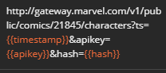
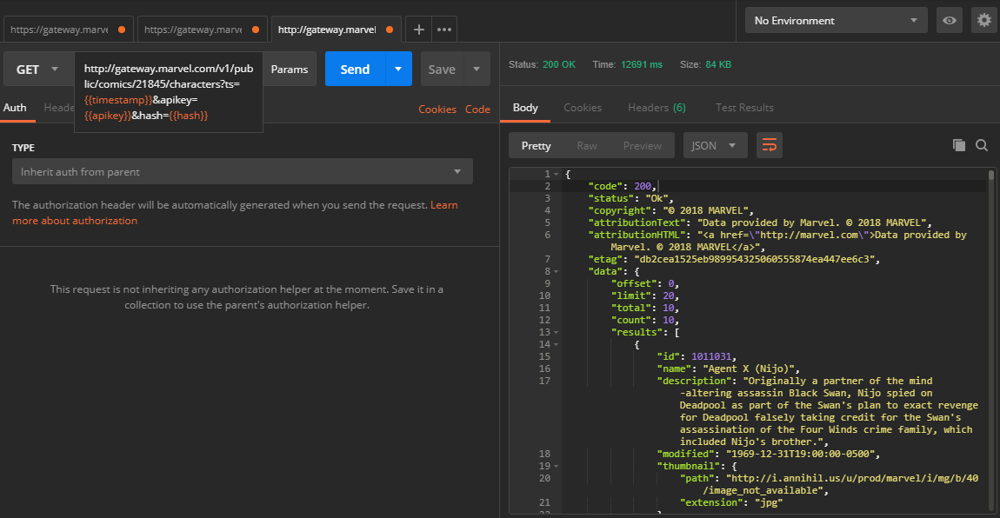
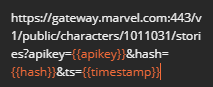
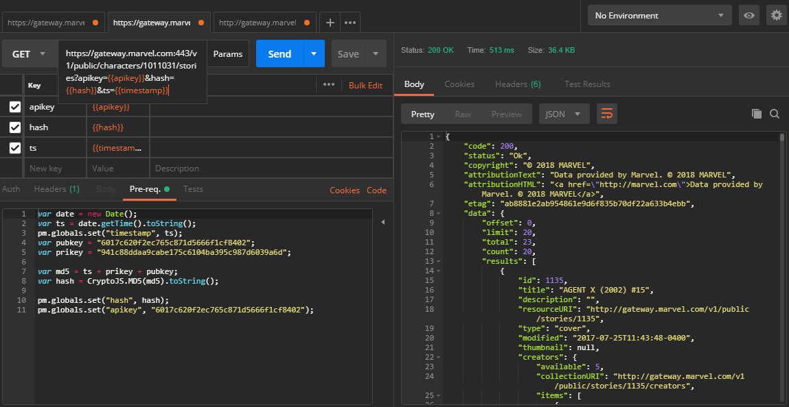

# Challenge 2

La meta era extraer una serie de JSONs de la API de Marvel a traves de un programa determinado. 

Mi programa de eleccion fue Postman y aqui describo el proceso para realizar la meta. 

# 1: Setting up Postman

Luego de descargar, instalar y configurar la aplicacion de Postman se requirió establecer la conexión con la API de Marvel, para lo cual se necesitó realizar el registro para obtener una clave publica y privada, ya que sin estas seria imposible enviarle peticiones a la API. 

 

Luego de obtener las claves, al ingresarlas a Postman resultó en un error de autentificación, lo cual me llevo a investigar que era necesario para realizar las peticiones.

se necesitaba enviar como parametros el TimeStamp y un hash constituido por el valor del md5 de: el mismo TimeStamp, la Private Key y la Public Key concatenados.

Para lo cual se necesito hacer un Pre-request script que calculara estos valores de esta forma:

 

# 2: Getting the API Responses

Despues de que el script calculara el hash se procedió a realizar las peticiones especificas que son la meta de este challenge.

Se obtubó la URI de el comic Cable&Deadpool (\#46) buscando con la peticion de todos los personajes para la primera petición.

 

Luego de utilizar la URI obtenida se obtuvo el JSON con toda la informacion del comic, incluyendo la informacion requerida.

 

ver Week2\Challenge2\Source\CDcharacters.json

Para la segunda petición, se obtuvo el ID de Agent X (Nijo) traves de la primera petición ya que aparece en ese comic. a lo cual se hizo la siguiente petición

 

Con esto se obtuvo el segundo JSON acerca de el Agente X (Nijo) en el cual se encuentras las historias en las que aparece.

 

ver Week2\Challenge2\Source\Agent X Stories.json
